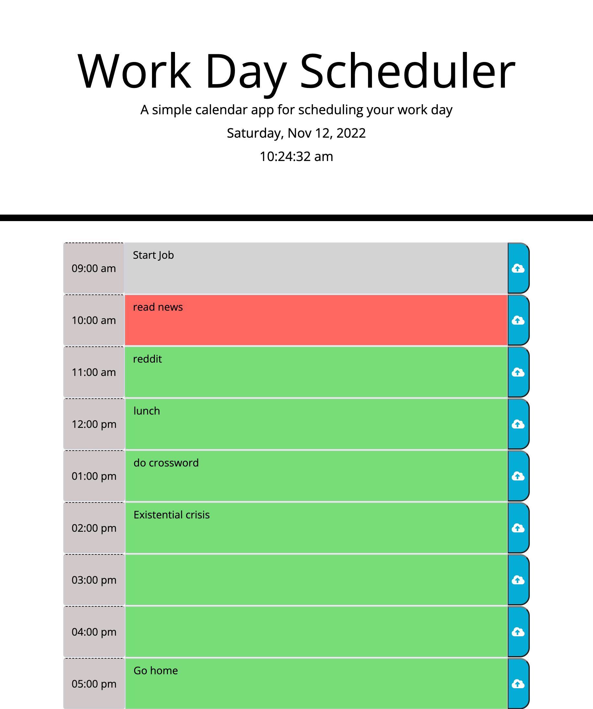

# wk5 - Workday Scheduler

# Description
The purpose of this project is to create a workday scheduler which displays the current date and time (dyncamically updating), and into which the user can enter text corresponding to any of the timeslots shown. 

When the user clicks the save button, the entry corresponding to that save button in the scheduler is saved into local storate and will be retrieved/displayed whenever user refreshes the window.

The HTML was updated to include all of the timeblocks corresponding to a 9-5 workday. The CSS file was updated to change the text color of the entries. The javascript file was built from scratch.

## Installation

N/A

## Usage

Open the webpage using the [live URL link](https://chloeeh.github.io/hanks-workday-scheduler/) and use Chrome Developer Tools to inspect the source code. The code is commented and includes accessibility tags compared to the original code that used generic division tags.

## Credits

Resources used:
1) Bootcamp Pre-work Modules
2) [Update Clock](https://stackoverflow.com/questions/5091888/how-to-update-time-regularly)
3) [Format .dayjs()](https://day.js.org/docs/en/display/format) 
4) [Bootstrap input-group](https://getbootstrap.com/docs/4.0/components/input-group/)
5) [Javascript siblings](https://www.javascripttutorial.net/javascript-dom/javascript-siblings/)
6) [Count number of elements](https://bobbyhadz.com/blog/javascript-count-number-of-elements-with-class#:~:text=To%20count%20the%20number%20of,the%20number%20of%20matching%20elements.)
7) [Get all of HTML element into array](https://stackoverflow.com/questions/20262052/get-all-span-innerhtml-in-an-array)

## License

Please refer to the LICENSE in the repository.